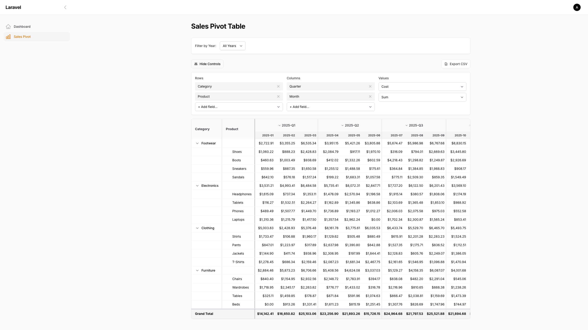

<p align="center">
    
</p>

# Filament Pivot Table

A powerful, interactive pivot table widget for Filament v3. Transform your data into insightful cross-tabulations with hierarchical rows, collapsible columns, and real-time aggregations.

<p align="center">
    
</p>

## Demo

Try the live demo: [plugins-demo.premte.ch/admin/sales-pivot](https://plugins-demo.premte.ch/admin/sales-pivot)

**Credentials:**
- Email: `admin@example.com`
- Password: `password`

## Features

- **Hierarchical Rows** - Group data by multiple dimensions with expand/collapse
- **Multi-level Columns** - Nested column headers with collapse support
- **Dynamic Configuration** - Change rows, columns, and values on the fly
- **Multiple Aggregations** - Sum, Average, Count, Min, Max
- **Row & Column Totals** - Automatic total calculations
- **Grand Total** - Overall summary row
- **Drill-Down** - Click any cell to see underlying data records
- **CSV Export** - Export visible data to CSV
- **URL Deep Linking** - Share specific pivot configurations via URL
- **Dark Mode** - Full Tailwind dark mode support
- **i18n Ready** - Translation support included
- **Array Data Source** - Use raw arrays instead of Eloquent models (API, CSV, etc.)

## Installation

```bash
composer require pt-plugins/filament-pivot-table
```

## Usage

### Basic Usage

Add the pivot table widget to any Filament page:

```php
@livewire('pivot-table-widget', [
    'name' => 'sales-pivot',
    'model' => \App\Models\Sale::class,
    'availableFields' => [
        ['name' => 'category', 'label' => 'Category', 'type' => 'string'],
        ['name' => 'product', 'label' => 'Product', 'type' => 'string'],
        ['name' => 'region', 'label' => 'Region', 'type' => 'string'],
        ['name' => 'quarter', 'label' => 'Quarter', 'type' => 'string'],
        ['name' => 'month', 'label' => 'Month', 'type' => 'string'],
        ['name' => 'amount', 'label' => 'Amount', 'type' => 'numeric'],
        ['name' => 'quantity', 'label' => 'Quantity', 'type' => 'numeric'],
    ],
    'rowDimensions' => ['category', 'product'],
    'columnDimensions' => ['quarter', 'month'],
    'aggregationField' => 'amount',
    'aggregationType' => 'sum',
])
```

### Configuration Options

| Option | Type | Default | Description |
|--------|------|---------|-------------|
| `name` | string | `'pivot-table'` | Unique identifier for the pivot table |
| `model` | string | * | Eloquent model class |
| `data` | array | * | Raw array data (alternative to model) |
| `availableFields` | array | `[]` | Fields available for pivot configuration |

> **Note:** Use either `model` OR `data`, not both. One is required.
| `rowDimensions` | array | `[]` | Default row grouping fields |
| `columnDimensions` | array | `[]` | Default column grouping fields |
| `aggregationField` | string | `''` | Field to aggregate |
| `aggregationType` | string | `'sum'` | Aggregation type (sum, avg, count, min, max) |
| `showConfigPanel` | bool | `true` | Show/hide configuration controls |
| `stickyRowHeaders` | bool | `false` | Enable sticky row dimension columns |
| `stickyColumnWidth` | int | `150` | Width of sticky columns in pixels |
| `filters` | array | `[]` | Filters to apply to data query |
| `valuePrefix` | string | `''` | Prefix for formatted values (e.g., '$') |
| `valueSuffix` | string | `''` | Suffix for formatted values (e.g., '%') |
| `drillDownEnabled` | bool | `false` | Enable click-to-drill-down on cells |

### Field Definition

Each field in `availableFields` should have:

```php
[
    'name' => 'field_name',      // Database column name
    'label' => 'Display Label',  // Human-readable label
    'type' => 'string',          // 'string' or 'numeric'
]
```

Only `numeric` type fields can be used for aggregation values.

### Using Array Data

Instead of an Eloquent model, you can pass raw array data directly. This is useful for data from APIs, CSV files, or pre-processed data:

```php
@livewire('pivot-table-widget', [
    'name' => 'api-pivot',
    'data' => [
        ['region' => 'North', 'product' => 'Widget A', 'quarter' => 'Q1', 'sales' => 1500],
        ['region' => 'North', 'product' => 'Widget A', 'quarter' => 'Q2', 'sales' => 1800],
        ['region' => 'South', 'product' => 'Widget B', 'quarter' => 'Q1', 'sales' => 2200],
        // ... more data
    ],
    'availableFields' => [
        ['name' => 'region', 'label' => 'Region', 'type' => 'string'],
        ['name' => 'product', 'label' => 'Product', 'type' => 'string'],
        ['name' => 'quarter', 'label' => 'Quarter', 'type' => 'string'],
        ['name' => 'sales', 'label' => 'Sales', 'type' => 'numeric'],
    ],
    'rowDimensions' => ['region', 'product'],
    'columnDimensions' => ['quarter'],
    'aggregationField' => 'sales',
    'aggregationType' => 'sum',
])
```

When using array data:
- Filters are applied in-memory using Laravel Collections
- All filter operators work the same (`like`, `gt`, `between`, etc.)
- Drill-down functionality is fully supported

### Value Formatting (Prefix/Suffix)

Add currency symbols or other prefixes/suffixes to values:

```php
@livewire('pivot-table-widget', [
    'valuePrefix' => '$',      // Shows: $1,234.56
    // or
    'valueSuffix' => '%',      // Shows: 1,234.56%
    // or both
    'valuePrefix' => '$',
    'valueSuffix' => ' USD',   // Shows: $1,234.56 USD
])
```

Formatting is handled client-side by Alpine.js, keeping the underlying data clean for calculations.

### External Filtering

Filter pivot data from parent components using the `filters` parameter:

```php
@livewire('pivot-table-widget', [
    'model' => \App\Models\Sale::class,
    'filters' => ['year' => 2025],
    // ... other options
])
```

Filter by multiple values using arrays:

```php
'filters' => [
    'year' => 2025,
    'region' => ['North', 'South'],  // whereIn
    'status' => 'active',
]
```

#### Reactive Filters from Parent Livewire Component

The `filters` property is reactive (`#[Reactive]`), so changes from a parent Livewire component will automatically refresh the pivot:

```php
// Parent component
class SalesPage extends Component
{
    public int $selectedYear = 2025;

    public function render()
    {
        return view('sales-page', [
            'pivotFilters' => ['year' => $this->selectedYear],
        ]);
    }
}
```

```blade
{{-- sales-page.blade.php --}}
<select wire:model.live="selectedYear">
    <option value="2024">2024</option>
    <option value="2025">2025</option>
</select>

@livewire('pivot-table-widget', [
    'filters' => $pivotFilters,
    // ...
])
```

### URL Deep Linking

The pivot table automatically syncs its state to URL query parameters:

```
/admin/sales-pivot?rows[0]=category&rows[1]=product&cols[0]=quarter&value=amount&agg=sum
```

This allows users to:
- Share specific pivot configurations
- Bookmark favorite views
- Navigate with browser back/forward

### Translations

Publish translations to customize labels:

```bash
php artisan vendor:publish --tag=pivot-table-translations
```

Available locales: `en`, `sr`

## Expand/Collapse

### Rows
Click the arrow icon next to any parent row to collapse/expand its children.

### Columns
Click on a parent column header (e.g., "Q1") to collapse all its child columns into a single aggregated column showing the sum (Σ).

## CSV Export

Click the "Export CSV" button to download the current pivot view. The export:
- Respects current collapse state
- Handles colspan/rowspan correctly
- Includes all visible data

## Drill-Down

Enable drill-down to allow users to click on any cell and see the underlying data records that make up that aggregated value.

### Enabling Drill-Down

```php
@livewire('pivot-table-widget', [
    'name' => 'sales-pivot',
    'model' => \App\Models\Sale::class,
    'availableFields' => [
        ['name' => 'category', 'label' => 'Category', 'type' => 'string'],
        ['name' => 'product', 'label' => 'Product', 'type' => 'string'],
        ['name' => 'region', 'label' => 'Region', 'type' => 'string'],
        ['name' => 'amount', 'label' => 'Amount', 'type' => 'numeric'],
    ],
    'rowDimensions' => ['category', 'product'],
    'columnDimensions' => ['region'],
    'aggregationField' => 'amount',
    'drillDownEnabled' => true,  // Enable drill-down
])
```

### How It Works

1. **Click on any value cell** - Cells become clickable with a hover effect
2. **Modal opens** - A Filament modal displays the filtered data
3. **Automatic filtering** - Data is filtered by the row and column dimensions of the clicked cell
4. **All columns shown** - The modal table displays all fields from `availableFields`

### Example

If your pivot table shows:

| Category | Product | North | South |
|----------|---------|-------|-------|
| Clothing |         | $500  | $300  |
|          | T-Shirt | $300  | $200  |
|          | Jeans   | $200  | $100  |

Clicking on the **$300** cell (Clothing → T-Shirt → North) will open a modal showing all sales records where:
- `category = 'Clothing'`
- `product = 'T-Shirt'`
- `region = 'North'`

The modal heading will display: **Category: Clothing | Product: T-Shirt | Region: North**

### Styling

When drill-down is enabled:
- Cells get `cursor-pointer` class
- Hover effect: `hover:bg-primary-50 dark:hover:bg-primary-900/20`
- Modal uses Filament's standard `<x-filament::modal>` component

## Examples

### Sales by Category and Product, by Quarter and Month

```php
'rowDimensions' => ['category', 'product'],
'columnDimensions' => ['quarter', 'month'],
'aggregationField' => 'revenue',
'aggregationType' => 'sum',
```

### Customer Count by Region

```php
'rowDimensions' => ['region', 'city'],
'columnDimensions' => ['year'],
'aggregationField' => 'customer_id',
'aggregationType' => 'count',
```

### Average Order Value by Product

```php
'rowDimensions' => ['product'],
'columnDimensions' => ['month'],
'aggregationField' => 'order_total',
'aggregationType' => 'avg',
```

## Styling

The pivot table uses Tailwind CSS and respects Filament's dark mode. Key CSS classes:

- `.pivot-table-container` - Main container
- `.pivot-table-widget` - Widget wrapper

## Requirements

- PHP 8.1+
- Laravel 10+
- Filament 3.x
- Livewire 3.x

## License

MIT License. See [LICENSE](LICENSE) for details.

## Contributing

Contributions are welcome! Please read our contributing guidelines before submitting PRs.

## Support

- [GitHub Issues](https://github.com/ptplugins/filament-pivot-table/issues)
- Email: mihailo@premte.ch
