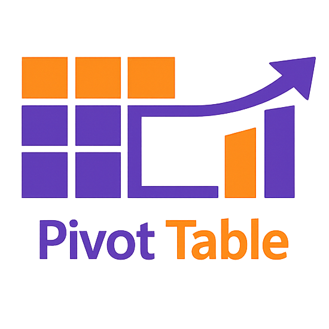
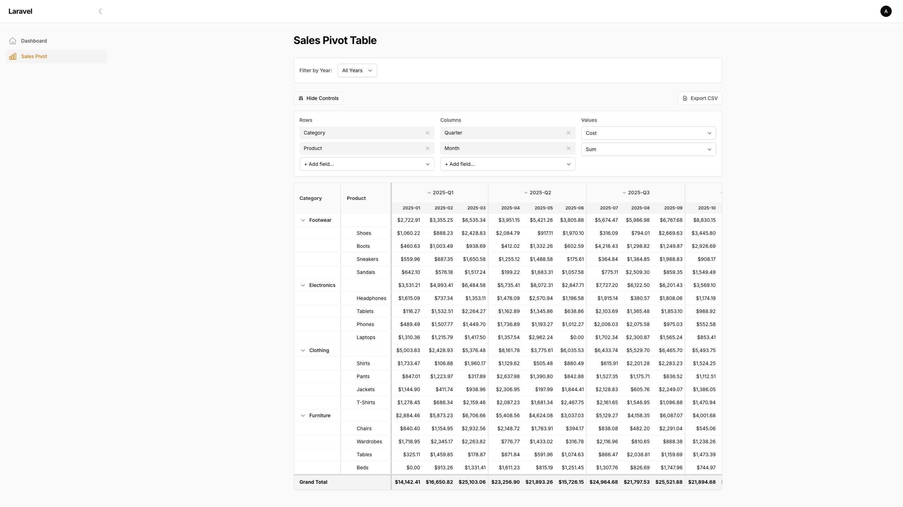

<p align="center">
    
</p>

# Filament Pivot Table

A powerful, interactive pivot table widget for Filament v3. Transform your data into insightful cross-tabulations with hierarchical rows, collapsible columns, and real-time aggregations.

<p align="center">
    
</p>

## Demo

Try the live demo: [plugins-demo.premte.ch/admin/sales-pivot](https://plugins-demo.premte.ch/admin/sales-pivot)

**Credentials:**
- Email: `admin@example.com`
- Password: `password`

## Features

- **Hierarchical Rows** - Group data by multiple dimensions with expand/collapse
- **Multi-level Columns** - Nested column headers with collapse support
- **Dynamic Configuration** - Change rows, columns, and values on the fly
- **Multiple Aggregations** - Sum, Average, Count, Min, Max
- **Row & Column Totals** - Automatic total calculations
- **Grand Total** - Overall summary row
- **Drill-Down** - Click any cell to see underlying data records
- **CSV & Excel Export** - Export visible data to CSV or Excel (configurable)
- **Dimension Reordering** - Drag-free reordering of row/column dimensions with arrows
- **Column Sorting** - Click column headers to sort data
- **Drill-Down Filters** - Auto-generated filters in drill-down modal
- **URL Deep Linking** - Share specific pivot configurations via URL
- **Dark Mode** - Full Tailwind dark mode support
- **i18n Ready** - Translation support included
- **Array Data Source** - Use raw arrays instead of Eloquent models (API, CSV, etc.)

## Installation

```bash
composer require pt-plugins/filament-pivot-table
```

## Usage

### Basic Usage

Add the pivot table widget to any Filament page:

```php
@livewire('pivot-table-widget', [
    'name' => 'sales-pivot',
    'model' => \App\Models\Sale::class,
    'availableFields' => [
        ['name' => 'category', 'label' => 'Category', 'type' => 'string'],
        ['name' => 'product', 'label' => 'Product', 'type' => 'string'],
        ['name' => 'region', 'label' => 'Region', 'type' => 'string'],
        ['name' => 'quarter', 'label' => 'Quarter', 'type' => 'string'],
        ['name' => 'month', 'label' => 'Month', 'type' => 'string'],
        ['name' => 'amount', 'label' => 'Amount', 'type' => 'numeric'],
        ['name' => 'quantity', 'label' => 'Quantity', 'type' => 'numeric'],
    ],
    'rowDimensions' => ['category', 'product'],
    'columnDimensions' => ['quarter', 'month'],
    'aggregationField' => 'amount',
    'aggregationType' => 'sum',
])
```

### Configuration Options

| Option | Type | Default | Description |
|--------|------|---------|-------------|
| `name` | string | `'pivot-table'` | Unique identifier for the pivot table |
| `model` | string | * | Eloquent model class |
| `data` | array | * | Raw array data (alternative to model) |
| `availableFields` | array | `[]` | Fields available for pivot configuration |

> **Note:** Use either `model` OR `data`, not both. One is required.
| `rowDimensions` | array | `[]` | Default row grouping fields |
| `columnDimensions` | array | `[]` | Default column grouping fields |
| `aggregationField` | string | `''` | Field to aggregate |
| `aggregationType` | string | `'sum'` | Aggregation type (sum, avg, count, min, max) |
| `showConfigPanel` | bool | `true` | Show/hide configuration controls |
| `stickyRowHeaders` | bool | `false` | Enable sticky row dimension columns |
| `stickyColumnWidth` | int | `150` | Width of sticky columns in pixels |
| `rowHeight` | string | `null` | CSS height value for uniform row heights (e.g., '3.5rem') |
| `filters` | array | `[]` | Filters to apply to data query |
| `valuePrefix` | string | `''` | Prefix for formatted values (e.g., '$') |
| `valueSuffix` | string | `''` | Suffix for formatted values (e.g., '%') |
| `drillDownEnabled` | bool | `false` | Enable click-to-drill-down on cells |
| `csvExportEnabled` | bool | `true` | Show/hide CSV export button |
| `xlsxExportEnabled` | bool | `true` | Show/hide Excel export button |

### Field Definition

Each field in `availableFields` should have:

```php
[
    'name' => 'field_name',      // Database column name
    'label' => 'Display Label',  // Human-readable label
    'type' => 'string',          // 'string' or 'numeric'
]
```

Only `numeric` type fields can be used for aggregation values.

### Using Array Data

Instead of an Eloquent model, you can pass raw array data directly. This is useful for data from APIs, CSV files, or pre-processed data:

```php
@livewire('pivot-table-widget', [
    'name' => 'api-pivot',
    'data' => [
        ['region' => 'North', 'product' => 'Widget A', 'quarter' => 'Q1', 'sales' => 1500],
        ['region' => 'North', 'product' => 'Widget A', 'quarter' => 'Q2', 'sales' => 1800],
        ['region' => 'South', 'product' => 'Widget B', 'quarter' => 'Q1', 'sales' => 2200],
        // ... more data
    ],
    'availableFields' => [
        ['name' => 'region', 'label' => 'Region', 'type' => 'string'],
        ['name' => 'product', 'label' => 'Product', 'type' => 'string'],
        ['name' => 'quarter', 'label' => 'Quarter', 'type' => 'string'],
        ['name' => 'sales', 'label' => 'Sales', 'type' => 'numeric'],
    ],
    'rowDimensions' => ['region', 'product'],
    'columnDimensions' => ['quarter'],
    'aggregationField' => 'sales',
    'aggregationType' => 'sum',
])
```

When using array data:
- Filters are applied in-memory using Laravel Collections
- All filter operators work the same (`like`, `gt`, `between`, etc.)
- Drill-down functionality is fully supported

### Row Height Configuration

For long category names that wrap to multiple lines, you can set a uniform row height to ensure consistent appearance:

```php
@livewire('pivot-table-widget', [
    'rowHeight' => '3.5rem',  // All rows will have this height
    // ... other options
])
```

Row labels automatically support text wrapping with `line-clamp-2` (max 2 lines). Combined with a fixed `rowHeight`, this ensures all rows appear uniform even with varying text lengths.

### Value Formatting (Prefix/Suffix)

Add currency symbols or other prefixes/suffixes to values:

```php
@livewire('pivot-table-widget', [
    'valuePrefix' => '$',      // Shows: $1,234.56
    // or
    'valueSuffix' => '%',      // Shows: 1,234.56%
    // or both
    'valuePrefix' => '$',
    'valueSuffix' => ' USD',   // Shows: $1,234.56 USD
])
```

Formatting is handled client-side by Alpine.js, keeping the underlying data clean for calculations.

### External Filtering

Filter pivot data from parent components using the `filters` parameter:

```php
@livewire('pivot-table-widget', [
    'model' => \App\Models\Sale::class,
    'filters' => ['year' => 2025],
    // ... other options
])
```

Filter by multiple values using arrays:

```php
'filters' => [
    'year' => 2025,
    'region' => ['North', 'South'],  // whereIn
    'status' => 'active',
]
```

#### Reactive Filters from Parent Livewire Component

The `filters` property is reactive (`#[Reactive]`), so changes from a parent Livewire component will automatically refresh the pivot:

```php
// Parent component
class SalesPage extends Component
{
    public int $selectedYear = 2025;

    public function render()
    {
        return view('sales-page', [
            'pivotFilters' => ['year' => $this->selectedYear],
        ]);
    }
}
```

```blade
{{-- sales-page.blade.php --}}
<select wire:model.live="selectedYear">
    <option value="2024">2024</option>
    <option value="2025">2025</option>
</select>

@livewire('pivot-table-widget', [
    'filters' => $pivotFilters,
    // ...
])
```

### Filament Resource Integration

For seamless integration with Filament Resources, extend `ListPivotRecords` instead of manually embedding the widget. This provides automatic filter integration, drill-down support with original records, and a consistent look with Filament's table pages.

```php
<?php

namespace App\Filament\Resources\SaleResource\Pages;

use App\Filament\Resources\SaleResource;
use Illuminate\Database\Eloquent\Builder;
use Illuminate\Support\Facades\DB;
use PtPlugins\FilamentPivotTable\Pages\ListPivotRecords;

class ListSalesPivot extends ListPivotRecords
{
    protected static string $resource = SaleResource::class;

    public function getPivotData(Builder $query): array
    {
        return $query
            ->select(
                'category',
                'region',
                'quarter',
                'month',
                DB::raw('SUM(cost) as cost'),
                DB::raw('SUM(quantity) as quantity'),
                DB::raw('COUNT(*) as count')
            )
            ->groupBy('category', 'region', 'quarter', 'month')
            ->get()
            ->toArray();
    }

    public function getDrillDownData(Builder $query, array $rowFilters, array $colFilters): array
    {
        foreach ($rowFilters as $field => $value) {
            $query->where($field, $value);
        }
        foreach ($colFilters as $field => $value) {
            $query->where($field, $value);
        }
        return $query->get()->toArray();
    }

    public function getDrillDownColumns(): array
    {
        return [
            ['name' => 'id', 'label' => 'ID', 'type' => 'numeric'],
            ['name' => 'category', 'label' => 'Category', 'type' => 'string'],
            ['name' => 'product', 'label' => 'Product', 'type' => 'string'],
            ['name' => 'region', 'label' => 'Region', 'type' => 'string'],
            ['name' => 'cost', 'label' => 'Cost', 'type' => 'numeric'],
            ['name' => 'quantity', 'label' => 'Quantity', 'type' => 'numeric'],
        ];
    }

    public function getPivotConfig(): array
    {
        return [
            'name' => 'sales-pivot',
            'availableFields' => [
                ['name' => 'category', 'label' => 'Category', 'type' => 'string'],
                ['name' => 'region', 'label' => 'Region', 'type' => 'string'],
                ['name' => 'quarter', 'label' => 'Quarter', 'type' => 'string'],
                ['name' => 'month', 'label' => 'Month', 'type' => 'string'],
                ['name' => 'cost', 'label' => 'Amount', 'type' => 'numeric'],
                ['name' => 'quantity', 'label' => 'Quantity', 'type' => 'numeric'],
                ['name' => 'count', 'label' => 'Count', 'type' => 'numeric'],
            ],
            'rowDimensions' => ['category'],
            'columnDimensions' => ['quarter', 'month'],
            'aggregationField' => 'cost',
            'aggregationType' => 'sum',
            'drillDownEnabled' => true,
            'rowHeight' => '3.5rem', // Optional: uniform row heights
        ];
    }
}
```

Then register the page in your Resource:

```php
public static function getPages(): array
{
    return [
        'index' => Pages\ListSales::route('/'),
        'pivot' => Pages\ListSalesPivot::route('/pivot'),
    ];
}
```

**Key benefits:**
- Filament table filters are automatically applied to pivot data
- Drill-down shows original database records (not aggregated data)
- Filter indicators and collapsible filter panel included
- Full Resource navigation integration

### Programmatic Configuration API

You can programmatically control the pivot table configuration from parent components using Livewire events. This is useful for creating preset configurations, saving user preferences, or building custom UI controls.

#### Setting Configuration

Dispatch the `set-pivot-configuration` event with your desired configuration:

```php
// In your ListPivotRecords page or parent Livewire component
public function loadPreset1(): void
{
    $this->dispatch('set-pivot-configuration', [
        'rows' => ['category', 'region'],
        'columns' => ['quarter'],
        'value' => 'cost',
        'aggregation' => 'sum',
    ]);
}
```

The configuration will be applied immediately and reflected in the URL parameters.

#### Getting Current Configuration

Request the current configuration and handle it in a listener. Use the **context parameter** to pass additional data (like save name, user ID, etc.) through the event chain:

```php
class ListSalesPivot extends ListPivotRecords
{
    protected $listeners = [
        'pivot-configuration-ready' => 'handlePivotConfiguration',
    ];

    public function saveCurrentConfiguration(string $name = 'My Config'): void
    {
        // Request current config WITH context parameters
        $this->dispatch('request-pivot-configuration',
            context: [
                'action' => 'save',
                'saveName' => $name,
                'userId' => auth()->id(),
                'timestamp' => now()->toIso8601String(),
            ]
        );
    }

    public function handlePivotConfiguration(array $configuration, array $context = []): void
    {
        // Handle the configuration with context
        // $configuration = [
        //     'rows' => ['category', 'region'],
        //     'columns' => ['quarter', 'month'],
        //     'value' => 'cost',
        //     'aggregation' => 'sum',
        // ]
        // $context = [
        //     'action' => 'save',
        //     'saveName' => 'My Config',
        //     'userId' => 1,
        //     'timestamp' => '2025-01-28T...',
        // ]

        $saveName = $context['saveName'] ?? 'Default';
        $userId = $context['userId'] ?? auth()->id();

        // Save to database, session, or display to user
        session([
            "pivot_config_{$saveName}" => [
                'configuration' => $configuration,
                'saved_at' => $context['timestamp'] ?? now(),
                'user_id' => $userId,
            ]
        ]);

        \Filament\Notifications\Notification::make()
            ->title("Configuration saved: {$saveName}")
            ->success()
            ->send();
    }
}
```

**Why use context?** Without context, you can't pass parameters (like save name) from your method to the handler. The context parameter solves this by flowing through the entire event chain:

```
saveCurrentConfiguration($name)
  → dispatch('request-pivot-configuration', context: ['saveName' => $name])
    → Widget: emitConfiguration($context)
      → dispatch('pivot-configuration-ready', config, context)
        → handlePivotConfiguration($config, $context)  ✓ $context['saveName'] preserved!
```

#### Adding Preset Buttons

You can add custom buttons to your view to trigger preset configurations. If you've published the views:

```blade
{{-- In your published list-pivot-records.blade.php view --}}
<button
    type="button"
    wire:click="loadPreset1"
    class="inline-flex items-center gap-2 px-3 py-2 text-sm font-medium..."
>
    Sales by Category & Region
</button>

<button
    type="button"
    wire:click="saveCurrentConfiguration"
    class="inline-flex items-center gap-2 px-3 py-2 text-sm font-medium..."
>
    Save Configuration
</button>
```

#### Complete Example

```php
<?php

namespace App\Filament\Resources\SaleResource\Pages;

use App\Filament\Resources\SaleResource;
use Illuminate\Database\Eloquent\Builder;
use PtPlugins\FilamentPivotTable\Pages\ListPivotRecords;

class ListSalesPivot extends ListPivotRecords
{
    protected static string $resource = SaleResource::class;

    protected $listeners = [
        'pivot-configuration-ready' => 'handlePivotConfiguration',
    ];

    // Preset 1: Category & Region by Quarter
    public function loadPreset1(): void
    {
        $this->dispatch('set-pivot-configuration', [
            'rows' => ['category', 'region'],
            'columns' => ['quarter'],
            'value' => 'cost',
            'aggregation' => 'sum',
        ]);
    }

    // Preset 2: Region by Month (Quantity)
    public function loadPreset2(): void
    {
        $this->dispatch('set-pivot-configuration', [
            'rows' => ['region'],
            'columns' => ['month'],
            'value' => 'quantity',
            'aggregation' => 'sum',
        ]);
    }

    // Save current configuration with custom name
    public function saveCurrentConfiguration(string $name = 'Default'): void
    {
        $this->dispatch('request-pivot-configuration',
            context: [
                'action' => 'save',
                'saveName' => $name,
                'userId' => auth()->id(),
            ]
        );
    }

    // Save as preset
    public function saveAsPreset(string $presetName): void
    {
        $this->dispatch('request-pivot-configuration',
            context: [
                'action' => 'save_preset',
                'presetName' => $presetName,
            ]
        );
    }

    // Handle configuration from widget (with context)
    public function handlePivotConfiguration(array $configuration, array $context = []): void
    {
        $action = $context['action'] ?? 'view';
        $saveName = $context['saveName'] ?? $context['presetName'] ?? 'Default';

        if ($action === 'save' || $action === 'save_preset') {
            // Save to user preferences or database
            auth()->user()->update([
                'pivot_preferences' => [
                    $saveName => $configuration,
                ],
            ]);

            \Filament\Notifications\Notification::make()
                ->title("Configuration saved: {$saveName}")
                ->body('Your pivot table preferences have been saved.')
                ->success()
                ->send();
        }
    }

    // ... rest of your methods (getPivotData, getDrillDownData, etc.)
}
```

**Available configuration keys:**
- `rows` - Array of field names for row dimensions
- `columns` - Array of field names for column dimensions
- `value` - Field name for aggregation value
- `aggregation` - Aggregation type: `sum`, `avg`, `count`, `min`, `max`, `percentage`

### URL Deep Linking

The pivot table automatically syncs its state to URL query parameters:

```
/admin/sales-pivot?rows[0]=category&rows[1]=product&cols[0]=quarter&value=amount&agg=sum
```

This allows users to:
- Share specific pivot configurations
- Bookmark favorite views
- Navigate with browser back/forward

### Translations

Publish translations to customize labels:

```bash
php artisan vendor:publish --tag=pivot-table-translations
```

Available locales: `en`, `sr`

## Expand/Collapse

### Rows
Click the arrow icon next to any parent row to collapse/expand its children.

### Columns
Click on a parent column header (e.g., "Q1") to collapse all its child columns into a single aggregated column showing the sum (Σ).

## CSV Export

Click the "Export CSV" button to download the current pivot view. The export:
- Respects current collapse state
- Handles colspan/rowspan correctly
- Includes all visible data

## Drill-Down

Enable drill-down to allow users to click on any cell and see the underlying data records that make up that aggregated value.

### Enabling Drill-Down

```php
@livewire('pivot-table-widget', [
    'name' => 'sales-pivot',
    'model' => \App\Models\Sale::class,
    'availableFields' => [
        ['name' => 'category', 'label' => 'Category', 'type' => 'string'],
        ['name' => 'product', 'label' => 'Product', 'type' => 'string'],
        ['name' => 'region', 'label' => 'Region', 'type' => 'string'],
        ['name' => 'amount', 'label' => 'Amount', 'type' => 'numeric'],
    ],
    'rowDimensions' => ['category', 'product'],
    'columnDimensions' => ['region'],
    'aggregationField' => 'amount',
    'drillDownEnabled' => true,  // Enable drill-down
])
```

### How It Works

1. **Click on any value cell** - Cells become clickable with a hover effect
2. **Modal opens** - A Filament modal displays the filtered data
3. **Automatic filtering** - Data is filtered by the row and column dimensions of the clicked cell
4. **All columns shown** - The modal table displays all fields from `availableFields`

### Example

If your pivot table shows:

| Category | Product | North | South |
|----------|---------|-------|-------|
| Clothing |         | $500  | $300  |
|          | T-Shirt | $300  | $200  |
|          | Jeans   | $200  | $100  |

Clicking on the **$300** cell (Clothing → T-Shirt → North) will open a modal showing all sales records where:
- `category = 'Clothing'`
- `product = 'T-Shirt'`
- `region = 'North'`

The modal heading will display: **Category: Clothing | Product: T-Shirt | Region: North**

### Drill-Down Filters

When drill-down is enabled, the modal automatically includes **SelectFilter** dropdowns for each non-numeric column. Filters are auto-populated with unique values from the current drill-down data.

This allows users to further filter the drill-down results without writing any additional code.

### Styling

When drill-down is enabled:
- Cells get `cursor-pointer` class
- Hover effect: `hover:bg-primary-50 dark:hover:bg-primary-900/20`
- Modal uses Filament's standard `<x-filament::modal>` component

## Column Sorting

Click on any column header to sort the pivot table rows by that column's values.

### How It Works

1. **First click** - Sort descending (highest values first)
2. **Second click** - Sort ascending (lowest values first)
3. **Third click** - Reset to original order

A sort indicator (↑/↓) appears in the column header to show the current sort direction.

### Supported Headers

- **Single-level columns** - Click directly on the column header
- **Multi-level columns** - Click on the child header (e.g., click "Jan" under "Q1")

Sorting is session-based and does not persist in the URL.

## Dimension Reordering

Use the up/down arrow buttons to reorder row and column dimensions without drag-and-drop.

### How to Use

1. Open the configuration panel (click "Show Controls")
2. Each dimension badge shows arrow buttons:
   - **↑** Move dimension up (higher in hierarchy)
   - **↓** Move dimension down (lower in hierarchy)
3. The pivot table re-renders immediately with the new dimension order

### Example

If your rows are `[Category, Product, Region]`:
- Click ↓ on "Category" → `[Product, Category, Region]`
- Click ↑ on "Region" → `[Product, Region, Category]`

## Export Configuration

Control which export buttons are visible using configuration options.

### Hiding Export Buttons

```php
@livewire('pivot-table-widget', [
    'name' => 'sales-pivot',
    'model' => \App\Models\Sale::class,
    // ... other options
    'csvExportEnabled' => false,   // Hide CSV export
    'xlsxExportEnabled' => true,   // Show Excel export
])
```

Or in `getPivotConfig()` for Resource integration:

```php
public function getPivotConfig(): array
{
    return [
        'name' => 'sales-pivot',
        // ... other options
        'csvExportEnabled' => true,
        'xlsxExportEnabled' => false,  // Hide Excel export
    ];
}
```

Export settings also apply to the drill-down modal - if Excel export is disabled for the main pivot, it will also be disabled in drill-down.

## Examples

### Sales by Category and Product, by Quarter and Month

```php
'rowDimensions' => ['category', 'product'],
'columnDimensions' => ['quarter', 'month'],
'aggregationField' => 'revenue',
'aggregationType' => 'sum',
```

### Customer Count by Region

```php
'rowDimensions' => ['region', 'city'],
'columnDimensions' => ['year'],
'aggregationField' => 'customer_id',
'aggregationType' => 'count',
```

### Average Order Value by Product

```php
'rowDimensions' => ['product'],
'columnDimensions' => ['month'],
'aggregationField' => 'order_total',
'aggregationType' => 'avg',
```

## Styling

The pivot table uses Tailwind CSS and respects Filament's dark mode. Key CSS classes:

- `.pivot-table-container` - Main container
- `.pivot-table-widget` - Widget wrapper

## Requirements

- PHP 8.1+
- Laravel 10+
- Filament 3.x
- Livewire 3.x

## License

MIT License. See [LICENSE](LICENSE) for details.

## Contributing

Contributions are welcome! Please read our contributing guidelines before submitting PRs.

## Support

- [GitHub Issues](https://github.com/ptplugins/filament-pivot-table/issues)
- Email: plugins@premte.ch
